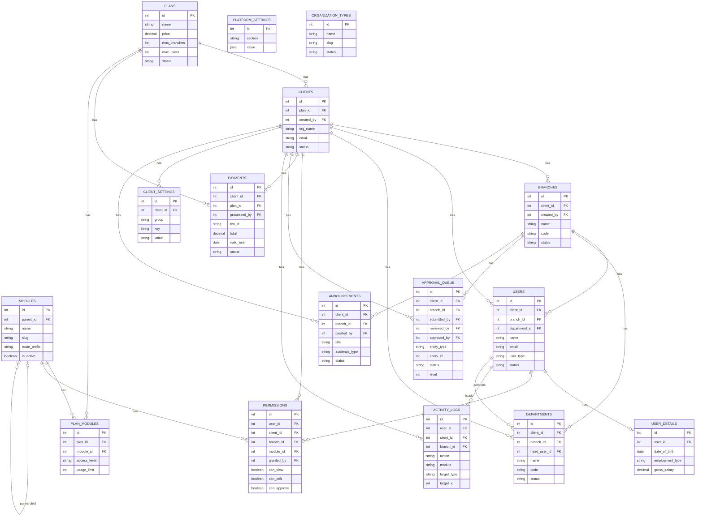
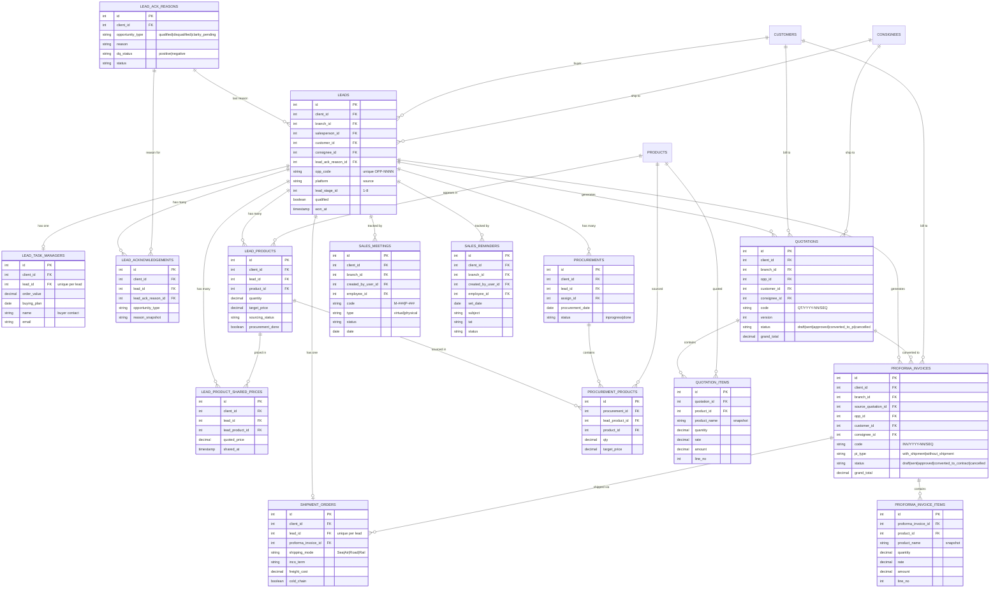

# Cross_Border_Command — Entity Relationship Diagram (ERD)

> Database: **PostgreSQL** (`c_b_c`) · ORM: **Laravel 12 / Eloquent** · 228 migrations, 85+ models.
> Generated 2026-06-03 from the model layer (`$fillable` + relationship methods) cross-checked against migrations.

## How to read this document

- The schema is split into **6 domain diagrams** (Mermaid `erDiagram`). View this file in any Markdown renderer with Mermaid support (GitHub, VS Code Mermaid preview, Obsidian).
- Only **primary keys (PK)**, **foreign keys (FK)**, and a handful of important business columns are shown per table — not every column. Timestamps (`created_at`, `updated_at`, `deleted_at`) are omitted from most tables for readability; **most business tables soft-delete** (`deleted_at`).
- **Multi-tenancy:** almost every table carries `client_id` (FK → `clients`); many also carry `branch_id` (FK → `branches`). To keep the diagrams readable, the per-table `client_id`/`branch_id` links to the tenancy domain are described in text rather than drawn as edges in every domain diagram.
- `created_by` / `updated_by` / `*_by` columns are FKs to `users` used for audit trails.

---

## 1. Tenancy, Auth, Billing & Platform

The tenancy root. **`clients`** (the company that bought the SaaS) → **`branches`** (their offices) → **`users`** (employees). `plans` + `modules` + `plan_modules` drive billing/feature-gating; `permissions` + `client_settings` drive authorization.

**Notes**
- `users.user_type` distinguishes super_admin / client_admin / client_user / branch_user.
- `user_details` is a 1:1 extension of `users` (employment/salary/personal info).
- `modules` is self-referential (`parent_id`) for the hierarchical menu; `plan_modules` gates which modules a plan unlocks.
- `approval_queue` is a generic multi-level approval ledger keyed polymorphically by `entity_type` + `entity_id`.
- `platform_settings` and `organization_types` are **not** tenant-scoped (platform-wide reference data).

---

## 2. Sales Pipeline (the 6-stage Sales Matrix)

**`leads`** (a.k.a. opportunities, code `OPP-NNNN`) is the spine. A lead moves through stages and spawns acknowledgements, product/price rows, quotations, proforma invoices, procurements and a shipment order.

**Notes**
- `lead_acknowledgements`, `lead_product_shared_prices` are **append-only history**; the latest row reflects current state.
- Quotation codes `QT/YYYY-NN/SEQ` and PI codes `INV/YYYY-NN/SEQ` are allocated per-client under a row lock (PG advisory lock).
- `quotation_items` / `proforma_invoice_items` snapshot `product_name` so deleting a product never orphans line history.
- `shipment_orders` and `lead_task_managers` are 1:1 with a lead (`lead_id` unique).

---

## 3. Customers, Consignees, Products & Vendors (masters)

Each master is **step-wise** with per-step status columns. A `customer` can own many `consignees` (KYC mirrored). Products and vendors link via two mapping tables.

```mermaid
erDiagram
    CUSTOMERS ||--o{ CUSTOMER_ADDRESSES : has
    CUSTOMERS ||--o{ CUSTOMER_DOCUMENTS : has
    CUSTOMERS ||--o{ CUSTOMER_OWNERS : has
    CUSTOMERS ||--o{ CONSIGNEES : "parent of"
    CONSIGNEES ||--o{ CONSIGNEE_ADDRESSES : has
    CONSIGNEES ||--o{ CONSIGNEE_DOCUMENTS : has
    CONSIGNEES ||--o{ CONSIGNEE_OWNERS : has
    PRODUCTS ||--o{ PRODUCT_QC_RECORDS : has
    PRODUCTS ||--o{ PRODUCT_VENDOR_MAPS : "inline vendor"
    PRODUCTS ||--o{ VENDOR_PRODUCT_MAPPINGS : "supplied via"
    VENDORS ||--o{ VENDOR_ADDRESSES : has
    VENDORS ||--o{ VENDOR_DOCUMENTS : has
    VENDORS ||--o{ VENDOR_OWNERS : has
    VENDORS ||--o{ VENDOR_BANK_ACCOUNTS : has
    VENDORS ||--o{ VENDOR_GST_SCRUTINY : has
    VENDORS ||--o{ VENDOR_PRODUCT_MAPPINGS : supplies

    CUSTOMERS {
        int id PK
        int client_id FK
        int branch_id FK
        int created_by FK
        string customer_code
        string company_name
        string segment
        string risk_level
        string status
    }
    CUSTOMER_ADDRESSES {
        int id PK
        int customer_id FK
        string type
        string country
        string city
        string cp_name "contact person"
        boolean is_primary
    }
    CUSTOMER_DOCUMENTS {
        int id PK
        int customer_id FK
        string kind "kyc|dd|tl"
        string license_number
        date expiry_date
        string attachment_path
        string status
    }
    CUSTOMER_OWNERS {
        int id PK
        int customer_id FK
        string owner_name
        string official_email
        string id_proof_path
        string status
    }
    CONSIGNEES {
        int id PK
        int client_id FK
        int branch_id FK
        int customer_id FK
        string consignee_code
        string company_name
        string segment
        boolean same_as_customer
        string status
    }
    CONSIGNEE_ADDRESSES {
        int id PK
        int consignee_id FK
        string type
        string country
        string cp_name
        boolean is_primary
    }
    CONSIGNEE_DOCUMENTS {
        int id PK
        int consignee_id FK
        string kind
        string license_number
        date expiry_date
        string attachment_path
    }
    CONSIGNEE_OWNERS {
        int id PK
        int consignee_id FK
        string owner_name
        string official_email
        string status
    }
    PRODUCTS {
        int id PK
        int client_id FK
        int branch_id FK
        string product_code
        string name
        int segment_id
        int uom_id
        int hsn_id
        decimal base_price
        decimal total_price
        string status
        int step_completed
    }
    PRODUCT_QC_RECORDS {
        int id PK
        int product_id FK
        string qc_name
        string issued_by
        text min_acceptance_criteria
        string attachment_path
    }
    PRODUCT_VENDOR_MAPS {
        int id PK
        int product_id FK
        string vendor_code
        string vendor_name
        decimal purchase_price
        decimal total_amount
    }
    VENDORS {
        int id PK
        int client_id FK
        int branch_id FK
        int vendor_type_id FK
        int risk_level_id FK
        int segment_id FK
        string vendor_code
        string company_name
        string status
        int step_completed
    }
    VENDOR_ADDRESSES {
        int id PK
        int vendor_id FK
        int country_id FK
        int state_id FK
        string city
        string contact_name
        boolean is_primary
    }
    VENDOR_DOCUMENTS {
        int id PK
        int vendor_id FK
        int license_type_id FK
        string kind "kyc|dd|tl"
        string license_number
        date expiry_date
        boolean mandatory
        string attachment_path
    }
    VENDOR_OWNERS {
        int id PK
        int vendor_id FK
        string document_name
        string document_number
        date issue_date
        string status
    }
    VENDOR_BANK_ACCOUNTS {
        int id PK
        int vendor_id FK
        string bank_name
        string account_number
        string ifsc
        string cheque_path
    }
    VENDOR_GST_SCRUTINY {
        int id PK
        int vendor_id FK
        string gst_number
        date last_filing_date
        text red_flags
        string status
    }
    VENDOR_PRODUCT_MAPPINGS {
        int id PK
        int vendor_id FK
        int product_id FK
        string batch_serial_lot
        decimal purchase_price
        decimal total_amount
    }
```

**Notes**
- Product steps: **core → sales → quality → vendors**; Vendor steps: **identity → contacts → KYC → products**. `step_completed` (and per-step status columns in the migration) track progress; each step saves independently.
- `consignees.customer_id` always ties a consignee to a parent customer; `same_as_customer` + the `ConsigneeKycMirror` service deep-clone KYC docs/owners.
- `product_vendor_maps` is the legacy inline vendor list on a product; `vendor_product_mappings` is the proper Vendor↔Product link table (vendor step 4). Both can coexist.

---

## 4. CLM (Central Legal Module)

Segment-driven compliance. Catalogue tables (KYC / DD / QC / trade licenses / clauses / T&Cs / agreements) feed the **DCP rule engine** (`clm_segment_rules`) and the **Zoho Sign** flow (`clm_signature_requests`).

```mermaid
erDiagram
    CLM_SEGMENTS ||--o{ CLM_SEGMENT_RULES : "drives"
    CLM_AGREEMENT_TYPES ||--o{ CLM_AGREEMENT_LIBRARY : "categorizes"
    CLM_CLAUSE_TYPES ||--o{ CLM_CLAUSE_LIBRARY : "categorizes"
    CLM_TNC_CATEGORIES ||--o{ CLM_TNC_LIBRARY : "categorizes"
    CLM_TRADE_DOC_NAMES ||--o{ CLM_TRADE_DOC_LIBRARY : "categorizes"

    CLM_SEGMENTS {
        int id PK
        int client_id FK
        string code
        string name
        string regulatory_status
        string buyer_consignee
        string status
    }
    CLM_AUTHORITIES {
        int id PK
        int client_id FK
        string code
        string name
        string status
    }
    CLM_KYC_DOCUMENTS {
        int id PK
        int client_id FK
        string code
        string name
        string authority
        string expiry
        string status
    }
    CLM_DD_DOCUMENTS {
        int id PK
        int client_id FK
        string code
        string name
        string authority
        string status
    }
    CLM_QC_DOCUMENTS {
        int id PK
        int client_id FK
        string code
        string name
        string purpose
        string issued_by
        string status
    }
    CLM_TRADE_LICENSES {
        int id PK
        int client_id FK
        string code
        string name
        string authority
        string validity
        string status
    }
    CLM_TRADE_DOC_NAMES {
        int id PK
        int client_id FK
        string code
        string name
        string status
    }
    CLM_TRADE_DOC_LIBRARY {
        int id PK
        int client_id FK
        string code
        string title
        string doc_type
        string party
        string status
    }
    CLM_TNC_CATEGORIES {
        int id PK
        int client_id FK
        string short_code
        string name
        string status
    }
    CLM_TNC_LIBRARY {
        int id PK
        int client_id FK
        string code
        string segment
        string category
        string party
        string status
    }
    CLM_AGREEMENT_TYPES {
        int id PK
        int client_id FK
        string code
        string name
        string status
    }
    CLM_AGREEMENT_LIBRARY {
        int id PK
        int client_id FK
        string code
        string agreement_type
        string title
        string party
        string status
    }
    CLM_CLAUSE_TYPES {
        int id PK
        int client_id FK
        string code
        string name
        string status
    }
    CLM_CLAUSE_LIBRARY {
        int id PK
        int client_id FK
        string code
        string clause_type
        string name
        string status
    }
    CLM_SEGMENT_RULES {
        int id PK
        int client_id FK
        int segment_id FK
        string rule_code
        string regulatory_status
        json doc_selections
        int mandatory_count
        string status
    }
    CLM_SIGNATURE_REQUESTS {
        int id PK
        int client_id FK
        int branch_id FK
        int trade_doc_id
        json trade_doc_ids
        string model_name
        int party_id
        string zoho_request_id
        string status
    }
    SEGMENT_DOC_UPLOADS {
        int id PK
        int client_id FK
        string uploadable_type "polymorphic"
        int uploadable_id
        string category
        string doc_code
        string requirement
        string status
    }
```

**Notes**
- All CLM catalogue tables are tenant-scoped (`client_id`) and are essentially per-client reference libraries.
- `clm_segment_rules.doc_selections` (JSON) lists which catalogue docs are mandatory/optional for a segment + party type — this powers the DCP page.
- `clm_signature_requests` references the signing party **polymorphically** (`model_name` + `party_id` → Customer / Consignee / Vendor) and stores the Zoho `zoho_request_id` for webhook reconciliation.
- `segment_doc_uploads` is a **polymorphic** store (`uploadable_type` + `uploadable_id`) of actual uploaded files against a segment rule, scoped one file per (entity, category, doc_code).

---

## 5. HRMS (employees, attendance, leave, recruitment, HR docs)

**`employees`** is central (self-referential via `reporting_manager_id`). Attendance uses a parent/child multi-punch model; leave uses a plan↔type junction.

```mermaid
erDiagram
    EMPLOYEES ||--o{ EMPLOYEE_DOCUMENTS : has
    EMPLOYEES ||--o{ PREVIOUS_EMPLOYMENT : has
    EMPLOYEES ||--o| EMPLOYEE_EXITS : has
    EMPLOYEES ||--o{ ATTENDANCE : has
    EMPLOYEES ||--o{ LEAVE_REQUESTS : requests
    EMPLOYEES ||--o{ EXPENSE_CLAIMS : submits
    EMPLOYEES ||--o{ ADVANCE_REQUESTS : requests
    EMPLOYEES ||--o{ HR_GENERATED_DOCUMENTS : receives
    EMPLOYEES }o--o| EMPLOYEES : "reports to"

    ATTENDANCE ||--o{ ATTENDANCE_PUNCHES : has
    HIRING_REQUESTS ||--o{ RECRUITMENTS : spawns
    RECRUITMENTS ||--o{ CANDIDATES : has

    LEAVE_REQUESTS }o--|| MASTER_LEAVE_TYPES : "of type"
    LEAVE_REQUESTS }o--|| MASTER_LEAVE_PLANS : "under plan"
    MASTER_LEAVE_PLANS ||--o{ MASTER_LEAVE_PLAN_LEAVE_TYPES : "has types"
    MASTER_LEAVE_TYPES ||--o{ MASTER_LEAVE_PLAN_LEAVE_TYPES : "in plans"
    EXPENSE_CLAIMS }o--|| MASTER_EXPENSE_CATEGORIES : "category"

    HR_DOCUMENT_TEMPLATES ||--o{ HR_GENERATED_DOCUMENTS : generates
    HR_DOCUMENT_TEMPLATES ||--o{ HR_DOCUMENT_SIGNATURES : signs

    EMPLOYEES {
        int id PK
        int client_id FK
        int branch_id FK
        int user_id FK
        int department_id FK
        int designation_id FK
        int reporting_manager_id FK
        string emp_code
        string first_name
        date date_of_joining
        string status
    }
    EMPLOYEE_DOCUMENTS {
        int id PK
        int employee_id FK
        string document_key
        string file_path
        string status
    }
    EMPLOYEE_EXITS {
        int id PK
        int employee_id FK
        int reporting_manager_id FK
        string exit_type
        date last_working_day
        string reason_for_exit
    }
    EMPLOYEE_ONBOARDING_INVITES {
        int id PK
        int client_id FK
        int branch_id FK
        int employee_id FK
        string invitee_email
        date expected_join_date
        string status
    }
    PREVIOUS_EMPLOYMENT {
        int id PK
        int employee_id FK
        string company_name
        string job_title
        date start_date
        date end_date
    }
    HIRING_REQUESTS {
        int id PK
        int client_id FK
        int branch_id FK
        int department_id FK
        string code
        string job_role
        int openings
        string status
    }
    RECRUITMENTS {
        int id PK
        int client_id FK
        int hiring_request_id FK
        int hiring_manager_id FK
        int assigned_hr_id FK
        string code
        int openings
        date deadline
        string status
    }
    CANDIDATES {
        int id PK
        int client_id FK
        int recruitment_id FK
        string name
        string email
        decimal expected_salary_lpa
        string status
    }
    ATTENDANCE {
        int id PK
        int client_id FK
        int branch_id FK
        int employee_id FK
        date attendance_date
        datetime check_in_at
        datetime check_out_at
        string status
    }
    ATTENDANCE_PUNCHES {
        int id PK
        int attendance_id FK
        int employee_id FK
        datetime punched_at
        string direction "in|out"
        string method "face|manual"
    }
    LEAVE_REQUESTS {
        int id PK
        int client_id FK
        int employee_id FK
        int cover_person_id FK
        int leave_type_id FK
        int leave_plan_id FK
        date from_date
        date to_date
        decimal days
        string status
    }
    MASTER_LEAVE_PLANS {
        int id PK
        int client_id FK
        int branch_id FK
        string plan_name
        string calendar_year
        boolean is_default
        string status
    }
    MASTER_LEAVE_TYPES {
        int id PK
        int client_id FK
        string name
        string short_code
        boolean is_sick_medical
        string status
    }
    MASTER_LEAVE_PLAN_LEAVE_TYPES {
        int id PK
        int leave_plan_id FK
        int leave_type_id FK
        json config_json
    }
    EXPENSE_CLAIMS {
        int id PK
        int client_id FK
        int employee_id FK
        int manager_id FK
        int category_id FK
        string claim_no
        decimal amount
        string status
    }
    MASTER_EXPENSE_CATEGORIES {
        int id PK
        int client_id FK
        string code
        string name
        decimal monthly_limit
        string status
    }
    ADVANCE_REQUESTS {
        int id PK
        int client_id FK
        int employee_id FK
        int manager_id FK
        string advance_no
        string advance_type
        decimal amount
        string status
    }
    HR_DOCUMENT_TEMPLATES {
        int id PK
        int client_id FK
        int trigger_point_id FK
        string code
        string doc_type
        boolean requires_signature
        string status
    }
    HR_DOCUMENT_SIGNATURES {
        int id PK
        int client_id FK
        int template_id FK
        int employee_id FK
        json signers
        int current_index
        string status
    }
    HR_GENERATED_DOCUMENTS {
        int id PK
        int client_id FK
        int template_id FK
        int employee_id FK
        json custom_values
        string status
        datetime generated_at
    }
    HR_CUSTOM_FIELDS {
        int id PK
        int client_id FK
        int branch_id FK
        string name
        string type
    }
```

**Notes**
- `employees.reporting_manager_id` is self-referential (org chart / MyTeam).
- **Attendance:** `attendance` is per (employee, date); each tap is an `attendance_punches` row with strictly alternating `direction` (in→out→in→out, server-enforced 422 on violation).
- **Leave:** a `master_leave_plans` joins to `master_leave_types` via `master_leave_plan_leave_types`; a `leave_requests` row references both the type and the plan.
- **Expense/Advance:** two-stage approval (manager → HR) tracked by separate status columns.
- `hr_document_templates` → `hr_generated_documents` (DOCX/HTML merge) → `hr_document_signatures` (multi-signer capture).
- `advance_requests` is shared with the Sales domain (also surfaced there) — it's an employee-level entity.

---

## 6. Cross-domain key relationships (summary)

| From | To | Cardinality | Via |
|---|---|---|---|
| `clients` | everything | 1 : N | `client_id` on nearly every table |
| `branches` | most business tables | 1 : N | `branch_id` |
| `users` | `employees` | 1 : 1 (opt) | `employees.user_id` |
| `leads` | `customers` / `consignees` | N : 1 | `customer_id`, `consignee_id` |
| `customers` | `consignees` | 1 : N | `consignees.customer_id` |
| `leads` | `quotations` → `proforma_invoices` | 1 : N → 1 : N | `opp_id`, `source_quotation_id` |
| `products` ↔ `vendors` | link | M : N | `vendor_product_mappings` |
| CLM party docs | `customers`/`consignees`/`vendors` | polymorphic | `segment_doc_uploads.uploadable_type/id`, `clm_signature_requests.model_name/party_id` |
| `attendance` | `attendance_punches` | 1 : N | `attendance_id` |
| `leave_plans` ↔ `leave_types` | link | M : N | `leave_plan_leave_types` |

---

### Caveats
- Column lists are **representative, not exhaustive** — generated from `$fillable` + relationship methods and spot-checked against migrations. For exact types/constraints, consult `database/migrations/`.
- Some FK relationships are enforced only at the application layer (Eloquent), not always as DB-level foreign-key constraints.
- `*_status` step columns (products/vendors) exist per-step in the migration even where only `step_completed` is shown above.
